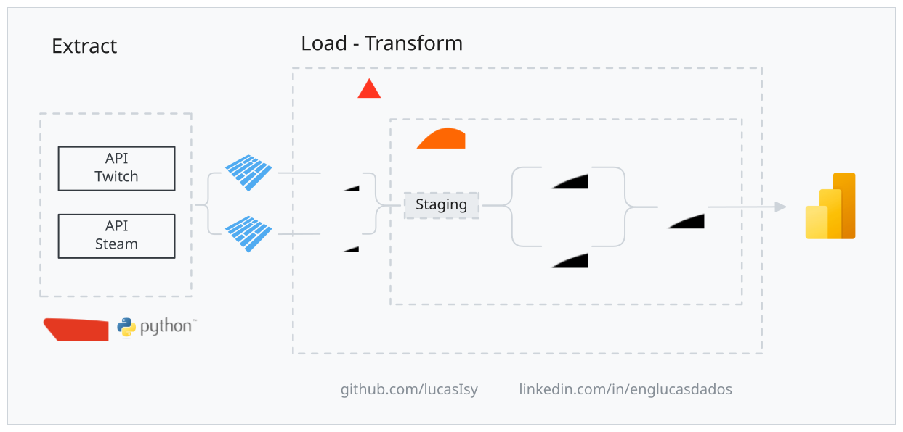
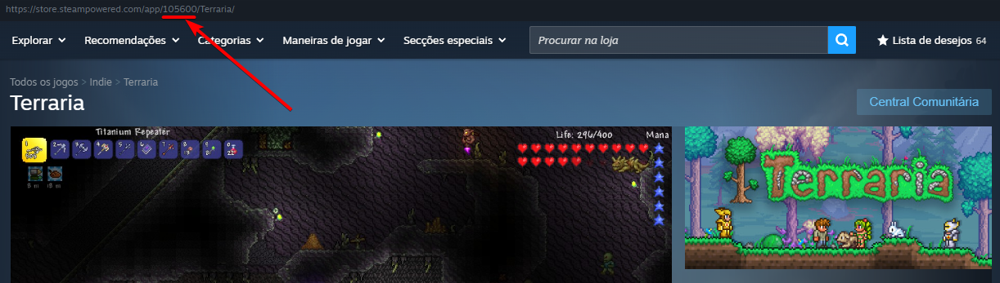

# Qual o objetivo do pipeline?
Para investigar quais decisões fizeram jogos de baixo orçamento alcançarem 100 mil jogadores em apenas 2 meses de lançamento, eu precisaria do histórico de métricas para fazer a correlação, mas as principais plataformas Steam(jogos) e Twitch(lives) não liberam esse histórico e apenas informam a quantidade de jogadores e lives.

A solução foi criar uma arquitetura de dados ELT que extrai os dados simultâneamente a cada 10 minutos, lida com os problemas da API da Twitch e otimiza o processamento de 133K dados por dias no Databricks.

> O SteamDB guarda esse histórico, mas não possuem uma api de extração e web scrapping não é uma solução a longo prazo.

## Problema da Steam e Twitch
Como citado, esses dados não estão disponíveis ao público comum, mas apenas aos próprios desenvolvedores do jogo. Porém, essas duas plataformas possuem peculiaridades relevantes na hora de criar uma solução:

**Twitch:**
- Necessita de autenticação utilizando Oauth e token
- Não existe um endpoint que entrega diretamente a quantidade de lives feitas daquele jogo ou lista de jogos, sendo necessário extrair todas as lives(por paginação) e processá-las para normalizar com os dados da Steam.
- Por causa da dinamicidade do dados vindos do endpoint, pode ocorrer duplicações no momento da paginação.

**Steam** 
- O método de extração não precisa de autenticação, mas existem limites de request

---

## Endpoints utilizados
**Steam:**
GetNumberOfCurrentPlayers/v1/ [Documentação Oficial](https://partner.steamgames.com/doc/webapi/isteamuserstats)

**Twitch:**
Get Streams - helix/streams [Documentação Oficial](https://dev.twitch.tv/docs/api/reference#get-streams)

---

## Como pegar os IDs dos jogos/categorias?
### Steam
O id dos apps ficam no url da página, acessando pelo aplicativo ou navegador. Caso o processo manual não seje viável, é necessário criar uma automação utilizando o endpoint [GetAppList/v1/](https://partner.steamgames.com/doc/webapi/IStoreService#GetAppList).

> Steam token necessária



### Twitch
Utiliza o endpoint [helix/games](https://dev.twitch.tv/docs/api/reference#get-games) passando o nome exato do jogo ou categoria, mas é necessário autenticação.

> A ideia é passar os nomes na variável do airflow, pois se quiser adicionar ou remover mais jogos/categorias é um processo mais fácil.

---

``` text
Guia das Pastas
├── 1_airflow_docker/ 
├── 2_databricks/
├── 3_dbt/
├── 5_problemas_e_otimizações/
│   ├── assets/
└── README.MD
```