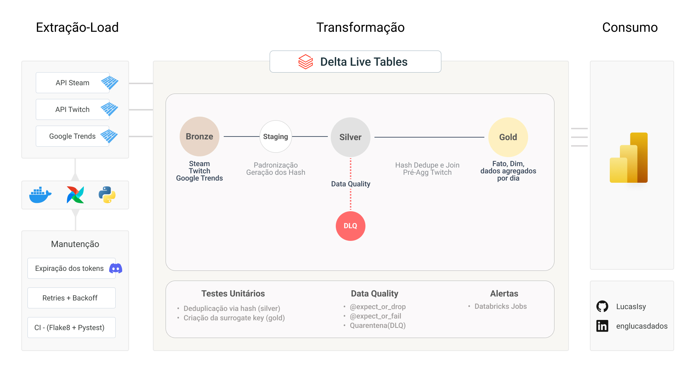

# Introdução
Há um tempo atrás eu queria demonstrar como a criação de conteúdo estava aumentando exponencialmente as vendas de jogos cooperativos na Steam, porém, a própria Steam e Twitch não liberam os dados históricos via API e qualquer solução de webscrapping estaria com os dias contados por conta da Cloud Flare.

Essa arquitetura foi criada para monitorar as plataformas oficiais e criar o meu próprio `SteamDB` ou `TwitchTracker`

> Com esse monitoramento e dados históricos foi possível tirar a [minha investigação](https://app.powerbi.com/view?r=eyJrIjoiMzYzZGExNjQtZDQzYy00OTQxLWI0ZWUtNjg5MjU3ODA2ODYwIiwidCI6IjllOTQ2M2EwLWMyNTEtNGNmNi04NDgxLWJlNzRmNWY2YzQ0YiJ9) do papel.

## Guia Rápido da Aquitetura

### 1. [Orquestração](./airflow-docker) 
Possui os **scripts** de `extração`, `autenticação`(Steam e Twitch), `pré-processamento` e a `lista de jogos monitorados`.

### 2. [APIs e seus problemas](airflow-docker) 
Aqui você encontra os `endpoints` utilizados, `como obter os tokens` de autenticação e o `problema na API da Twitch` que mudou a forma da transformação.

### 3. [Transformação dos Dados - Databricks ETL](databricks)
Inclui os `códigos PySpark`, a `lógica incremental`, as `tabela DLT` e `deduplicação e joins via hash`.

---

### Decisões de Arquitetura e Evolução
* **Trade-off de Ingestão:** Na prática a extração e orquestração devem ser *serverless* por conta do tempo de espera, mas o Airflow, Docker e Python foram utilizados também para por em prática meus estudos sobre eles.
* **Evolução da Stack:** O pipeline substituiu a abordagem inicial (Notebooks + dbt Core) por uma solução unificada dentro dos recursos nativos de ETL/Pipelines do Databricks.
* **Campos Críticos:**
  * ingested_at - gerado no airflow e é igual para todos os itens do batch
  * Streamer_ID - encontrados nos dados da Twitch e é a base para a deduplicação na silver.
  * game_name - está dentro dos dados da Steam e Twitch e será utilizado para unir as tabelas na Gold.

---

### Camadas de Dados (Medallion Architecture)

* **Bronze:**  
  * O pipeline é acionado a cada novo lote de arquivos Parquet gravados no catalogo.
  * Cada arquivo novo é inserido incrementalmente dentro das tabelas delta.
  * **Data Quality:** Validação via Great Expectations para garantir formato de *timestamp* UNIX válido e a ausência do ID dos streamers e dos jogos na Steam.

* **Staging:**  
  * Padronização de nomenclatura de colunas e schemas.
  * Geração do hash via xxhash64 para deduplicação na Silver

* **Silver (Tratamento & Agregação):**  
  * Deduplicação dos registros utilizando as chaves geradas na Staging.  
  * **Agregação Twitch:** A API não retorna as visualizações de cada jogo na plataforma, mas retorna uma lista de todas as lives ligadas sobre de determinado jogo. Com isso é necessário agregar essas lives individuais e obter as métricas desses jogos naquele instante.
  * A partir da silver, o hash da deduplicação gerado não é mais relevante.

* **Gold (Agregação e Centralização):**
  * Os dados são centralizados em uma tabela fato utilizando inner join via hash(Data + Game_Name)
  * Todas as métricas(steam, twitch e trends) estão atreladas a uma data, sempre mostrando a maior daquele dia.

| hash_id | date | game_name | steam_players | total_lives | hours_watched | total_search |
| :--- | :--- | :--- | :--- | :--- | :--- | :--- |
| `a1b2c3d4` | 2026-09-01 | Lethal Company | 45.200 | 1.250 | 320.400 | 78 |
| `e5f6g7h8` | 2026-09-02 | Content Warning | 12.800 | 430 | 95.120 | 32 |
| `i9j0k1l2` | 2026-09-03 | R.E.P.O. | 89.600 | 3.100 | 1.150.000 | 100 |
| `m3n4o5p6` | 2026-09-04 | PEAK | 5.400 | 120 | 18.750 | 14 |
| `q7r8s9t0` | 2026-09-05 | MIMESIS | 22.100 | 890 | 140.300 | 45 |
| `u1v2w3x4` | 2026-09-06 | Big Walk | 34.700 | 1.050 | 210.800 | 61 |

### Destino Final da Arquitetura

<a href="https://app.powerbi.com/view?r=eyJrIjoiMzYzZGExNjQtZDQzYy00OTQxLWI0ZWUtNjg5MjU3ODA2ODYwIiwidCI6IjllOTQ2M2EwLWMyNTEtNGNmNi04NDgxLWJlNzRmNWY2YzQ0YiJ9">Ver a Análise dos Dados</a>
   
  

